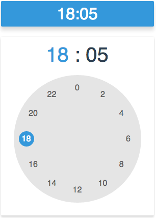
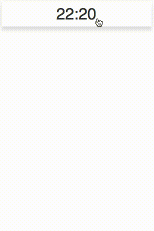

# Vue-Clock-Picker

[](https://badge.fury.io/js/vue-clock-picker) [](http://standardjs.com) [](https://github.com/DomonJi/vue-clock-picker/blob/master/LICENSE)

[](https://nodei.co/npm/vue-clock-picker/)

> A lite time picker vue-component, writing in es6 standrad style.

## SHOW

> 24 Hours Mode, with Material Design. Try the [Live Demo](https://domonji.github.io/vue-clock-picker)

 

Until now, this component has only one theme -- The Material Theme. I'll working on more themes later.

## HAVE A TRY

```bash
$ git clone https://github.com/DomonJi/vue-clock-picker.git

$ npm install

$ npm run dev
```

## INSTALL

```bash
$ npm install vue-clock-picker
```

dependencies:

- [`vue@^2.0.0`](https://github.com/vuejs/vue)
- [`pug@^2.0.0`](https://github.com/pugjs/pug)
- [`vue-loader@^9.4.0`](https://github.com/vuejs/vue-loader)

## USAGE

```html

<!-- in some vue component -->
<template>
    <div>
        <vue-clock-picker
            mode="24" :defaultHour="defaultHour"
            :defaultMinute="defaultMinute"
            :onTimeChange="timeChangeHandler"
        >
        </vue-clock-picker>
    </div>
</template>

<style>
/*your style*/
</style>
```

```javascript
<script>
import VueClockPicker from 'vue-clock-picker'
export default {
    components: {
        VueClockPicker
    },
    data(){
        return {
            defaultHour:new Date().getHours(),
            defaultMinute:new Date().getMinutes()
        }
    },
    methods:{
        timeChangeHandler(){
            // ...
        }
    }
}
</script>
```

> For more detail, you can see the source code.

## APIS

### Props

- `defaultHour`
- `defaultMinute`

`String or Number`

```javascript
defaultHour="12"
```

- `defaultFocused`

`Boolean`

Whether the picker pannel is focused or not when it did mount. Default `false`

```javascript
defaultFocused="false"
```

- `onFocusChange`

`Function`

The callback func when component `focused` state is changed.

- `onHourChange`

`Function`

The callback func when component `hour` state is changed.

```javascript
onHourChange(hour) {
  // ...
}
```

- `onMinuteChange`

`Function`

The callback func when component `minute` state is changed.

```javascript
onMinuteChange(minute) {
  // ...
}
```

- `onTimeChange`

`Function`

The callback func when component `hour` or `minute` is changed.

```javascript
onTimeChange(time) {
  let { hour, minute } = time
  // ...
}
```

## TODOS

- Test

  - [x] TimePicker Component
  - [x] PickerPointGenerator Component
  - [x] TimePickerModal Component
  - [x] PickerPoint Component
  - [ ] OutsideClickHandler Component

- Themes

  - [x] Material Theme
  - [ ] Classical Theme

- Mode

  - [ ] 12h mode
  - [x] 24h mode

- Animations

  - [x] Panel Animations
  - [ ] PickerModal Animations

## THANK

Thanks to the Ecmadao's open source project: [react-times](https://github.com/ecmadao/react-times), I have learn a lot from that. Thanks.
